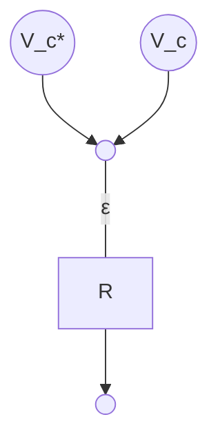

Generalmente ciò che indica lo stato di un componente non è propriamente una grandezza di controllo bensì una **grandezza di stato**, detta *di switch* alcune di queste possono poi essere controllate direttamente e assumono quindi il nome di **grandezza di controllo**.
Una grandezza di controllo ha proprietà differenti in base a quale componente dinamico essa è associata:
- Transistor: la grandezza di switch dipende solo dal tempo, è interamente controllabile
- Diodi: dipende solo dallo stato
- Tiristori: dipende dal tempo e dallo stato

Dunque non tutte le grandezze di switching sono di controllo, anche se associate ad un componente totalmente controllato.

Un esempio semplice è il caso in cui si voglia controllare la tensione d'uscita, la si confronta con una tensione desiderata e si invia l'errore $\varepsilon$ ad un regolatore $R$ che agisce di conseguenza sulle grandezze di controllo, modificando il comportamento del convertitore.

Si può vedere in dettaglio la modifica del modello matematico del [[Boost converter#grandezze di switching|boost converter]] nel caso in cui si considerino 

