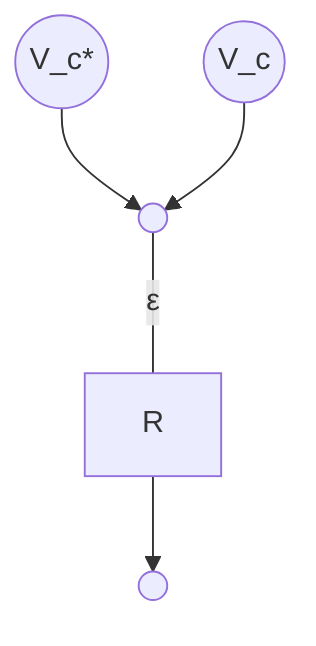
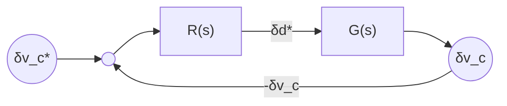

Generalmente ciò che indica lo stato di un componente non è propriamente una grandezza di controllo bensì una **grandezza di stato**, detta *di switch* alcune di queste possono poi essere controllate direttamente e assumono quindi il nome di **grandezza di controllo**.
Una grandezza di controllo ha proprietà differenti in base a quale componente dinamico essa è associata:
- Transistor: la grandezza di switch dipende solo dal tempo, è interamente controllabile
- Diodi: dipende solo dallo stato
- Tiristori: dipende dal tempo e dallo stato

Dunque non tutte le grandezze di switching sono di controllo, anche se associate ad un componente totalmente controllato.

Un esempio semplice è il caso in cui si voglia controllare la tensione d'uscita, la si confronta con una tensione desiderata e si invia l'errore $\varepsilon$ ad un regolatore $R$ che agisce di conseguenza sulle grandezze di controllo, modificando il comportamento del convertitore.

```mermaid
flowchart TB
A((V_c*)) --> C
B((V_c)) --> C(( ))
C ---|ε| D[R] --> E(( ))
```

Si può vedere in dettaglio la modifica del modello matematico del [[Boost converter#grandezze di switching|boost converter]] nel caso in cui si considerino 

# Controllo dei convertitori DC/DC
Esistono due principali tipologie di strategie di controllo per i convertitori DC/DC, spesso utilizzati come alimentatori, possono essere controllati in tensione o corrente, si desidera un'uscita fissa al variare del carico.
L'orbita del ciclo dinamico deve contenere il punto di equilibrio del [[modello averaged]] corrispondente.

A partire dal [[modello small signal]] si può ricavare la [[funzione di trasferimento]] del sistema generalizzata al secondo ordine:
$$
G(s) = G_{d{0}} \frac{\left(1-\frac{s}{\omega'_{z} }\right)}{1 + \frac{s}{Q\omega_{0}} + \left( \frac{s}{\omega_{0}} \right)^2} = \frac{\delta v_{c}}{\delta d}
$$
come mostrato in figura:

```mermaid
flowchart LR
A(("δv_c*")) --> B(( ))
B --> C["R(s)"]
C -->|δd*| D["G(s)"]
D --> E(("δv_c"))
E -->|"-δv_c"| B
```

dove $R(s)$ è il regolatore che controlla il sistema $G(s)$.
Fissati i margini di fase e di ampiezza si ottiene la [[funzione di trasferimento]] del regolatore:
$$
R(s) = \frac{A\left( 1+ \frac{s}{\omega_{z}} \right)^2}{s\left( 1 +\frac{s}{\omega_{p}} \right)^2}
$$
Vanno determinati i tre parametri della funzione $A,\omega_{p},\omega_{z}$.

Si calcola la funzione di trasferimento del controllore accoppiato al sistema per determinare il margine di ampiezza e di fase, definiti come il guadagno della fdt alla pulsazione in cui la fase è $-180°$. Il margine di fase è invece la distanza della fase della funzione a ciclo aperto dall'inversione di fase (ovvero $180°-\left|\angle T(\omega_{c})\right|$) in corrispondenza della pulsazione critica, ovvero quella in cui il modulo della funzione di trasferimento sia unitario.

Il regolatore non deve influenzare la stabilità del sistema, al fine di calcolare i parametri del regolatore si separa il calcolo della fase tra regolatore e sistema:
$$
P_{m} = 180° - \angle R(\omega_{c}) - \angle G(\omega_{c})
$$
dunque
$$
\angle R(\omega_{c}) = -90° + 2\arctan \left( \frac{\omega_{c}}{ \frac{\omega_{c}}{\sqrt{ k }} } \right) - 2\arctan \left( \frac{\omega_{c}}{\sqrt{ k }\omega_{c}} \right) = - 90° + 2\arctan \sqrt{ k } - 2\arctan \frac{1}{\sqrt{ k }}
$$
si vincola la posizione degli zeri e dei poli del regolatore:
$$
\omega_{z} = \frac{\omega_{c}}{\sqrt{ k }}\quad \omega_{p} = \omega_{c} \sqrt{ k }
$$
