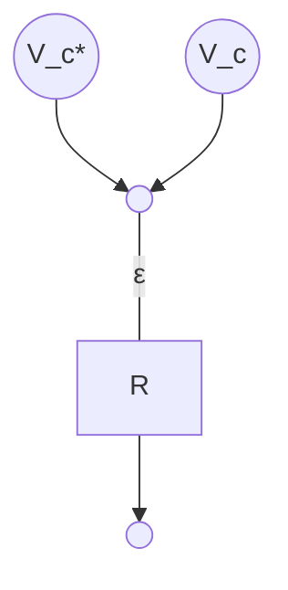
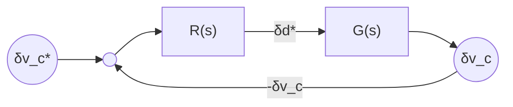

Generalmente ciò che indica lo stato di un componente non è propriamente una grandezza di controllo bensì una **grandezza di stato**, detta *di switch* alcune di queste possono poi essere controllate direttamente e assumono quindi il nome di **grandezza di controllo**.
Una grandezza di controllo ha proprietà differenti in base a quale componente dinamico essa è associata:
- Transistor: la grandezza di switch dipende solo dal tempo, è interamente controllabile
- Diodi: dipende solo dallo stato
- Tiristori: dipende dal tempo e dallo stato

Dunque non tutte le grandezze di switching sono di controllo, anche se associate ad un componente totalmente controllato.

Un esempio semplice è il caso in cui si voglia controllare la tensione d'uscita, la si confronta con una tensione desiderata e si invia l'errore $\varepsilon$ ad un regolatore $R$ che agisce di conseguenza sulle grandezze di controllo, modificando il comportamento del convertitore.

```mermaid
flowchart TB
A((V_c*)) --> C
B((V_c)) --> C(( ))
C ---|ε| D[R] --> E(( ))
```

Si può vedere in dettaglio la modifica del modello matematico del [[Boost converter#grandezze di switching|boost converter]] nel caso in cui si considerino 

# Controllo dei convertitori DC/DC
Esistono due principali tipologie di strategie di controllo per i convertitori DC/DC, spesso utilizzati come alimentatori, possono essere controllati in tensione o corrente, si desidera un'uscita fissa al variare del carico.
L'orbita del ciclo dinamico deve contenere il punto di equilibrio del [[modello averaged]] corrispondente.

A partire dal [[modello small signal]] si può ricavare la [[funzione di trasferimento]] del sistema generalizzata al secondo ordine:
$$
G(s) = G_{d{0}} \frac{\left(1-\frac{s}{\omega'_{z} }\right)}{1 + \frac{s}{Q\omega_{0}} + \left( \frac{s}{\omega_{0}} \right)^2} = \frac{\delta v_{c}}{\delta d}
$$
come mostrato in figura:

```mermaid
flowchart LR
A(("δv_c*")) --> B(( ))
B --> C["R(s)"]
C -->|δd*| D["G(s)"]
D --> E(("δv_c"))
E -->|"-δv_c"| B
```

dove $R(s)$ è il regolatore che controlla il sistema $G(s)$.
Fissati i margini di fase e di ampiezza si ottiene la [[funzione di trasferimento]] del regolatore:
$$
R(s) = \frac{A\left( 1+ \frac{s}{\omega_{z}} \right)^2}{s\left( 1 +\frac{s}{\omega_{p}} \right)^2}
$$
Vanno determinati i tre parametri della funzione $A,\omega_{p},\omega_{z}$.

Si calcola la funzione di trasferimento del controllore accoppiato al sistema per determinare il margine di ampiezza e di fase, definiti come il guadagno della funzione di trasferimento alla pulsazione in cui la fase è $-180°$. Il margine di fase è invece la distanza della fase della funzione a ciclo aperto dall'inversione di fase (ovvero $180°-\left|\angle T(\omega_{c})\right|$) in corrispondenza della pulsazione critica, ovvero quella in cui il modulo della funzione di trasferimento sia unitario.

Il regolatore non deve influenzare la stabilità del sistema, al fine di calcolare i parametri del regolatore si separa il calcolo della fase tra regolatore e sistema:
$$
P_{m} = 180° - \angle R(\omega_{c}) - \angle G(\omega_{c})
$$
dunque
$$
\angle R(\omega_{c}) = -90° + 2\arctan \left( \frac{\omega_{c}}{ \frac{\omega_{c}}{\sqrt{ k }} } \right) - 2\arctan \left( \frac{\omega_{c}}{\sqrt{ k }\omega_{c}} \right) = - 90° + 2\arctan \sqrt{ k } - 2\arctan \frac{1}{\sqrt{ k }}
$$
si vincola la posizione degli zeri e dei poli del regolatore:
$$
\omega_{z} = \frac{\omega_{c}}{\sqrt{ k }}\quad \omega_{p} = \omega_{c} \sqrt{ k }
$$
continuando a sviluppare il calcolo della fase si ricorda che:
$$
\begin{aligned}
\arctan{x} + \arctan \frac{1}{x} &= 90°\\
-\arctan \frac{1}{x} &= \arctan x - 90°
\end{aligned}
$$
dunque
$$
\begin{aligned}
\angle R(\omega_{c}) &= -90° + 4\arctan\left(\sqrt{ k }\right) - 180°\\
\angle R(\omega_{c}) &= -90° + \text{BOOST}
\end{aligned}
$$
dove si è indicato con BOOST il recupero di fase fornito dal regolatore.
Riprendendo la formula del margine di fase:
$$
P_{m} = 180° - \text{BOOST} + 90°- \angle G(\omega_{c})
$$
solitamente desiderato attorno ad un valore compreso tra 50° e 60°.
Conoscendo $\angle G(\omega_{c})$ e imposto il margine desiderato, dunque il valore di BOOST si ricava il valore di $k$:
$$
4\arctan \sqrt{ k } = \text{BOOST} + 180° \Rightarrow \arctan \sqrt{ k } = \frac{\text{BOOST}}{4} + 45°
$$
infine
$$
k = \tan^2\left[ \frac{\text{BOOST}}{4} + 45° \right]
$$
con la quale si può ricavare il guadagno $A$ del regolatore:
$$
R(s) = \frac{A\left( 1 + \frac{\omega_{c}\sqrt{ k }}{\omega_{c}} \right)^2}{\omega_{c}\left( 1+\frac{\omega_{c}}{\sqrt{ k}\omega_{c} } \right)^2}
$$
alla pulsazione $\omega_{c}$ il modulo del sistema a ciclo aperto deve essere unitario, dunque $||R\cdot G||=1\Rightarrow R=\frac{1}{G}$.
Resta da imporre $\omega_{c}=\frac{1}{2}\omega_{s}$ dove $\omega_{s}$ è la pulsazione di switching dei componenti del convertitore $\omega_{s}=\frac{2\pi}{T_{s}}$.
Questo è un valore limite teorico, solitamente si preferisce mantenere un margine di almeno $\frac{1}{5}$ di $\omega_{s}$.
La risposta dinamica migliora all'aumentare di $\omega_{c}$ ma aumenta anche la sensibilità del sistema ai disturbi esterni.

La procedura appena presentata prende il nome di **metodo del fattore K**, riassumendo:
1. Si fissa $\omega_{c}$ pari a meno di $\frac{1}{5}\omega_{s}$
2. Si vincola il margine di fase e si ricava il BOOST
3. Si calcola K con il quale ricavare i valori di $\omega_{z},\omega_{p}$ ed $A$
4. Si costruisce la forma di $R$

## Controllo di stato
In alternativa al metodo del fattore $K$ si può controllare un convertitore DC/DC mediante una *retroazione di stato*, ovvero si linearizza il sistema nell'intorno di un punto di equilibrio:
$$
\delta \dot{x} = A\delta x + B\delta d
$$
In particolare la matrice $A$ contiene la dinamica del sistema, i suoi autovalori sono legati ai modi di evoluzione dello stato e coincidono con i poli della funzione di trasferimento.
Si vuole realizzare un sistema che acceleri la dinamica del convertitore imponendo dei propri autovalori mediante una matrice di retroazione $K$.
$$
\delta d = -K \delta x
$$
Sostituendo
$$
\delta \dot{x} = A\delta x -BK\delta x
$$
Nel dominio di Laplace si può ricavare la soluzione:
$$
[s\hat{I} - A + BK]\delta x = 0
$$
Si supponga che il sistema sia del secondo ordine, esiste in tal caso una corrispondenza diretta tra i poli e le caratteristiche della risposta del sistema in termini di smorzamento e tempo caratteristico:
$$
-(p_{1}+p_{2}) = 2 \xi \omega_{0}
$$
dove $\xi$ è lo smorzamento e $\omega_{0}$ la pulsazione di risonanza del sistema:
$$
p_{1}\cdot p_{2} = \omega_{0}^2
$$
Fissati i parametri di risposta del sistema si possono calcolare i due poli desiderati $p_{1}$ e $p_{2}$, per ricavare invece la matrice $K$:
$$
\det[s\hat{I}-A+BK] = (s-p_{1})(s-p_{2})
$$
Questo sistema vale solo per sistemi del secondo ordine o ridotti al secondo ordine.
